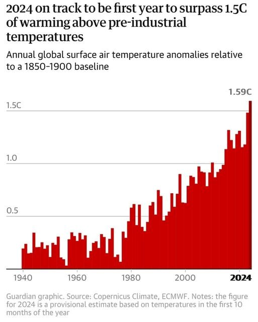
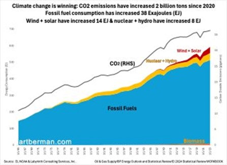
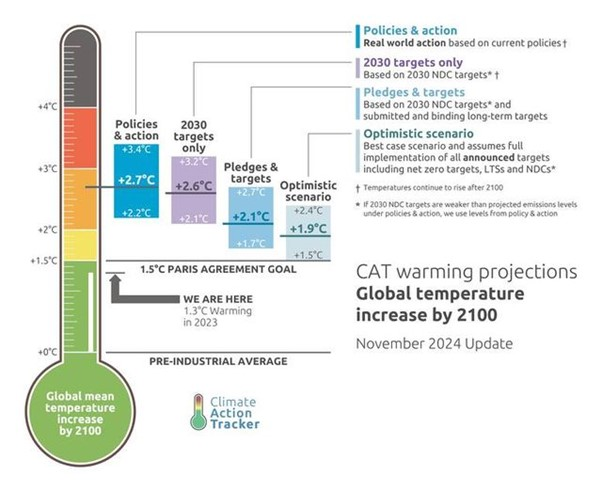
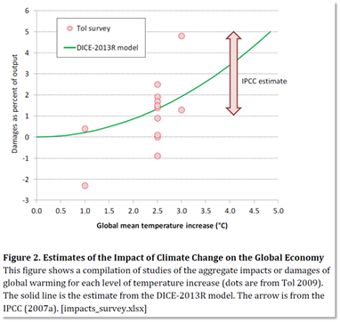
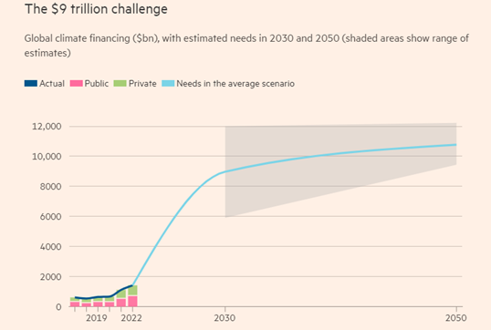

# COP-out 29 – Michael Roberts Blog

> ## Excerpt
> There was a tortuous and painful end to COP29, the international climate change conference held in oil-rich Baku, Azerbaijan. The main issue was how much would the rich countries hand over to the p…

---
  
There was a tortuous and painful end to COP29, the international climate change conference held in oil-rich Baku, Azerbaijan. The main issue was how much would the rich countries hand over to the poor countries to pay for the measures to mitigate global warming and handle the damage caused by rising ‘greenhouse gas’ emissions. The finance target set was for more than $1.3trn a year by 2035. But the final deal was based on just $300bn in actual grants and low-interest loans from the developed world. The rest would have to come from private investors and perhaps levies on fossil fuels and frequent flyers – the details of which remained vague.

The offer from the ‘developed’ countries, funded from their national budgets and overseas aid, is supposed to form the inner core of a so-called ‘layered’ finance settlement, accompanied by a middle layer of new forms of finance such as new taxes on fossil fuels and high-carbon activities, carbon trading and ‘innovative’ forms of finance; and an outermost layer of investment from the private sector, into projects such as solar and windfarms. This was a ‘copout’ from providing real money transfers.

Mohamed Adow, director of the Power Shift Africa thinktank, said: _“This \[summit\] has been a disaster for the developing world. It’s a betrayal of both people and planet, by wealthy countries who claim to take climate change seriously. Rich countries have promised to ‘mobilise’ some funds in the future, rather than provide them now. The cheque is in the mail. But lives and livelihoods in vulnerable countries are being lost now.”_

Juan Carlos Monterrey Gómez, Panama’s climate envoy concluded: _“This is definitely not enough. What we need is at least $5tn a year, but what we have asked for is just $1.3tn. That is 1% of global GDP. That should not be too much when you’re talking about saving the planet we all live on.” The final deal “comes to nothing when you split it. We have bills in the billions to pay after droughts and flooding. It won’t put us on a path to 1.5C. More like 3C.”_

More than 60,000 people had registered to attend the conference which had seen hotel prices rocket 500%. A standard room at the Baku Holiday Inn cost £700 a night for the duration of the conference compared to the usual £90. FlightRadar24, a flight tracking website, revealed that 65 private jets landed in Baku in the first week, twice as many as usual.

Edi Rama, Prime Minister of Albania commented “_People there eat, drink, meet and take photos together – while images of voiceless leaders play on and on and on in the background,”_ he said. “_To me, this seems exactly like what happens in the real world every day. Life goes on, with its old habits, and our speeches – full of good words about fighting climate change – change nothing. What does it mean for the future of the world if the biggest polluters continue as usual?”_ asked Rama. _“What on earth are we doing in this gathering, over and over and over, if there is no common political will on the horizon to go beyond words and unite for meaningful action?”_

At COP29, there was no further talk of ‘the transition away from burning fossil fuels’ as pledged by the world’s nations just a year ago, with 2024 on track to set another new record for global carbon emissions.

The latest data indicate that the planet-heating emissions from coal, oil and gas will rise by 0.8% in 2024. In stark contrast, emissions have to fall by 43% by 2030 for the world to have any chance of keeping to the 1.5C temperature rise target set by the COP Paris agreement. That target is dead and the planet is heading fast towards 2.0C rise (and above) compared to pre-industrial times.

Indeed, current policies put the temperature rise on track for a 2.7C rise. The expected level of global heating by the end of the century has not changed since 2021, with _“minimal progress”_ made this year, [according to the Climate Action Tracker project.](https://climateactiontracker.org/publications/the-climate-crisis-worsens-the-warming-outlook-stagnates/) The consortium’s estimate has not shifted since the Cop26 climate summit in Glasgow three years ago. _“We have clearly failed to bend the curve,”_ said Sofia Gonzales-Zuñiga, from Climate Analytics. The expected level of warming is slightly lower when including government pledges and targets, at 2.1C, but that has also not changed since 2021. Warming in the most optimistic scenario rose slightly from 1.8C last year to 1.9C this year, the report found. “We are causing global warming 100 times faster than past natural changes. _“We are taking Earth’s climate beyond natural limits, with CO2 & temps levels not seen for 3 million years.”_ [said Mark Maslin.](https://x.com/ProfMarkMaslin/status/1856263473417670851)

Changes in average global temperatures that sound small can lead to massive human suffering. Last month, a study found half of the 68,000 heat deaths in Europe in 2022 were the result of the 1.3C of global heating the world has seen so far. At the higher temperatures that are projected for the end of the century, the risk of irreversible and catastrophic extremes is also set to soar. Researchers warned their median warming estimate of 2.7C by 2100 had a wide enough margin of error that it could translate into far hotter temperatures than scientists were expecting. _“There is a 33% chance of our projection being 3C or higher, and a 10% chance of being 3.6C or higher,”_ said Gonzales-Zuniga. The latter would be “absolutely catastrophic”, she added.

And it’s not just carbon emissions. The fossil fuel industry emits dangerous amounts of its methane emissions – the most damaging of the greenhouse gases. While it may not persist as long in the atmosphere as carbon dioxide, over a 20-year timescale methane is 80 times more potent at trapping heat. It has been responsible for an estimated 30 per cent of the world’s warming since the industrial revolution.

Methane emissions are rising at a record rate, according to a study published in September in the journal Earth System Science Data. Over the past two decades, they have increased by around 20 per cent. Atmospheric concentrations of the gas are now more than 2.6 times higher than in pre-industrial times, the highest they’ve been in at least 800,000 years. It finds its way into the environment in several ways: vented into the atmosphere from oil and gas fields for safety reasons or in emergencies, or “flared” from pipes or chimneys, which turns it primarily into smoke and carbon dioxide. (If the flaring is inefficient, pure methane is emitted too.)

Fossil fuel air pollution is already responsible for 1 in 5 deaths worldwide. Worldwide, air pollution from burning fossil fuels is responsible for about 1 in 5 deaths—roughly the population of New York City. In the US, 350,000 premature deaths are attributed to fossil fuel pollution. Exposure to particulate matter from fossil fuels accounted for 21.5% of total deaths in 2012, falling to 18% in 2018 due to tightening air quality measures in China. In contrast, in India, fossil fuel pollution was responsible for nearly 2.5 million people (aged over 14) in 2018; representing over 30% of total deaths in India among people over age 14. Thousands of kids under age 5 die each year due to respiratory infections attributed to fossil fuel pollution.

Mainstream economics has failed to recognise the scale and impact of greenhouse gas emissions on the world economy. [William Nordhaus was awarded a Nobel (Riksbank) Prize in Economics in 2018 for modelling the costs and benefits of acting on climate change through limiting emissions](https://thenextrecession.wordpress.com/2018/10/09/climate-change-and-growth-nordhaus-and-romer/). He pioneered the mainstream economic analysis of climate change. Nordhaus’ contribution was to develop a model that could supposedly gauge the likely impact on economies from climate change.

Nordhaus constructed so-called integrated assessment models (IAMs) to estimate the social cost of carbon (SCC) and evaluate alternative abatement policies. IAMs are used to calculate the social cost of carbon (SCC). They attempt to model the incremental change in, or damage to, global economic output resulting from 1 tonne of anthropogenic carbon dioxide emissions or equivalent. These SCC estimates are used by policymakers in cost–benefit analyses of climate-change-mitigation policies. But because the IAMs omit so many of the big risks, SCC estimates are often way too low. The values often depend crucially on the ‘discounting’ used to translate future costs to current dollars.

These discount rates are central to any discussion. Most current models of climate-change impacts make two flawed assumptions: that people will be much wealthier in the future and that lives in the future are less important than lives now. The former assumption ignores the great risks of severe damage and disruption to livelihoods from climate change. The latter assumption is ‘discrimination by date of birth’. It is a value judgement that is rarely scrutinized, difficult to defend and in conflict with most moral codes.

The discount rate used to calculate the likely monetary damage to economies is arbitrary. If we use a 3% discount rate, that means the current rise in global warming would lead to $5trn of economic damage (loss of GDP), but the cost in current money of global warming would be no more than $400bn, about what China spends on hi-speed rail. So, on this discount rate, global warming causes little economic damage and thus the social cost of carbon (SCC) is only about $10/ton and mitigation action can be limited. This is what Nordhaus used in his model.

But why 3%? In 2018, Nicholas Stern, of the famous Stern Review on climate change, took Nordhaus’ data and applied a 1.4% discount rate. The SCC then rises to $85/ton – meaning that it costs economies $85 for every ton of Co2, or closer to $3trn. More recently, using more complex methods and realistic assumptions than the original, estimates for SCC have risen to $180-300 a ton.

Nordhaus’ IAMs have flaws that make them close to useless as tools for policy analysis. IAMs struggle to incorporate the scale of the scientific risks, such as the thawing of permafrost, release of methane, and other potential tipping points. Furthermore, many of the largest potential impacts are omitted, such as widespread conflict as a result of large-scale human migration to escape the worst-affected areas. IAMs do not account for risks and uncertainty. These models estimate damages each year by some damage factor x multiplied by T2 that year–meaning the very simple damage function is a gently upward-sloping line.

  
Recently deceased climate economist Martin Weitzman, a colleague of Nordhaus, disagreed with this approach to ‘discounting’ the future,. Weitzman pointed out the tremendous uncertainty in the forecasts of climate impacts, including tipping points, large error bars, and ‘unknown unknowns’. In economics-speak, he characterized this as enormous _“downside risk,”_ including a potentially small—but fundamentally unknown—chance of total human annihilation.

Weitzman argued that averages do not tell the full story. [Indeed, a Pareto probability distribution function of the current projections has ‘fat tails’](https://thenextrecession.wordpress.com/2020/02/11/the-climate-and-the-fat-tail-risk/) that suggest there is a 1% likelihood of a 12⁰C increase in temperature. Weitzman: _“the most striking feature of the economics of climate change is that its extreme downside is non-negligible. Deep structural uncertainty about the unknown unknowns of what might go very wrong is coupled with essentially unlimited downside liability on possible planetary damages.”_ With that kind of temperature increase, human life would probably not survive. The problem is tha_t “nobody lives in ‘global-average-land’!”_ [The storm following a drought that dumps a season of rainfall in a day likely has implications for financial risk, but is not captured in metrics of average annual precipitation in a region](https://metamodel.blog/posts/fed-climate-risk/). Economic models ignore these subtleties in climate. The model used by many of the world’s central banks, for example, relies on a damage function that relates regional economic and labour productivity to annual temperature and precipitation.

[Steve Keen has argued](https://www.tandfonline.com/doi/full/10.1080/14747731.2020.1807856) that IAMs _“assumed that empirical relationships derived from data on change in temperature and GDP between 1960 and 2014 can be extrapolated out to 2100—thus assuming that 3.2°C more of global warming won’t alter the climate! They have assumed that tipping points—critical features of the Earth’s climate such as the Greenland and West Antarctic ice sheets, the Amazon rain forest, and the “Atlantic Meridional Overturning Circulation” which keeps Europe warm today—can be tipped with only “minimal additional damage to GDP”._

Econometric calculations based on past behaviour ignore not only the ‘tipping points’ like methane releases from the melting permafrost, but also the ones that are far easier to to see, like the Great Salt Lake running dry. Society, too, has tipping points; infrastructure has breaking points; ecosystems have thresholds; after some level of temperature rise, crops don’t lose productivity, they just die—same with humans.

Despite the huge flaws in IAMs, they continue to have influence on policy, in particular to advocate ‘market solutions’ to climate change that do not require public investment in climate control or public ownership of the fossil fuel industry. For example, [Nordhaus was invited by the ECB and the G20 to advise on measures to deal with global warming. Nordhaus’s answer was carbon pricing markets.](https://thenextrecession.wordpress.com/2021/07/22/global-warming-planning-not-pricing/)

Nordhaus’ IAMs assume that the world economy will have a much larger GDP in 50 years so that even if carbon emissions rise as predicted, governments can defer the cost of mitigation to the future. In contrast, if you apply stringent carbon abatement measures eg ending all coal production, you might lower growth rates and incomes and so make it more difficult to mitigate in the future. Instead, according to Nordhaus, with carbon pricing and taxes we can control and reduce emissions without reducing fossil fuel production and consumption at source.

This is the tobacco/cigarette pricing and taxing solution. The higher the tax or price, the lower the consumption, without touching the tobacco industry. Leaving aside the question of whether smoking has really been eradicated globally by pricing adjustments, can global warming really be solved by market pricing? Market solutions to climate change are based on trying to correct “market failure” by incorporating the nefarious effects of carbon emissions via a tax or quota system. The argument goes that, as mainstream economic theory does not incorporate the social costs of carbon into prices, the price mechanism must be “corrected” through a tax or a new market.

Countries agreed a deal at the COP29 climate conference on rules for a global market to buy and sell carbon credits that proponents say will mobilise billions of dollars into new projects to help fight global warming. Y[et carbon credits have proved to be faked.](https://time.com/6264772/study-most-carbon-credits-are-bogus/) Last year, a [Bloomberg investigation found](https://www.bloomberg.com/graphics/2022-carbon-offsets-renewable-energy/) that almost 40% of the offsets purchased in 2021 came from renewable energy projects that didn’t actually avoid emissions.

This approach is hopelessly inadequate and unworkable. The world’s clean energy plans (and they are only plans) still fall almost one-third short of what is needed to reach that figure. And to reach the necessary level of investment, climate finance will need to increase to about $9tn a year globally by 2030, up from just under $1.3tn in 2021-22, according to the Climate Policy Initiative. The $1.3trn target set by COP29 (and now not met anyway) is miles short.

At COP29, IMF chief, Kristalina Georgieva said that _“98% of adaptation finance comes from public sources. This is not sustainable. We need to unleash the private sector at adaptation as well as mitigation. It can be done!”_ And ECB chief, Christine Lagarde added: “_We urgently need to unlock all possible sources of capital, at speed and at scale.”_ But private climate finance is pathetic at just $21.9bn in 2022, according to the OECD. And much of the public funding so far has been taken from existing overseas aid budgets. Only $21-24.5bn of the $83bn remains as pure climate finance without strings attached, according to Oxfam in its Climate Finance Shadow Report 2023.

Why is the climate target not being met? Why is the necessary finance not forthcoming? It is not the cost price of renewables. Prices of renewables have fallen sharply in the last few years. The problem is that governments are insisting that private investment should lead the drive to renewable power. [But private investment only takes place if it is profitable to invest.](https://thenextrecession.wordpress.com/2024/06/23/fixing-the-climate-it-just-aint-profitable/)

Profitability is the problem. Average profitability globally is at low levels and so investment growth in everything has similarly slowed. Ironically, lower renewables prices drag down the profitability of such investments. Solar panel manufacturing is suffering a severe profit squeeze, along with operators of solar farms. This reveals the fundamental contradiction in capitalist investment between reducing costs through higher productivity and slowing investment because of falling profitability.

[This is the key message from yet another excellent book by Brett Christophers, The Price is Wrong – why capitalism won’t save the planet.](https://thenextrecession.wordpress.com/2024/06/23/fixing-the-climate-it-just-aint-profitable/) Christophers argues that it is not the price of renewables versus fossil fuel energy that is the obstacle to meeting the investment targets to limit global warming. It is the profitability of renewables compared to fossil fuel production.

Market solutions won’t work because for capitalist companies it is just not profitable to invest in climate change mitigation. As the IMF itself put it: “_Private investment in productive capital and infrastructure faces high upfront costs and significant uncertainties that cannot always be priced. Investments for the transition to a low-carbon economy are additionally exposed to important political risks, illiquidity and uncertain returns, depending on policy approaches to mitigation as well as unpredictable technological advances.”_

Indeed: _“The large gap between the private and social returns on low-carbon investments is likely to persist into the future, as future paths for carbon taxation and carbon pricing are highly uncertain, not least for political economy reasons. This means that there is not only a missing market for current climate mitigation as carbon emissions are currently not priced, but also missing markets for future mitigation, which is relevant for the returns to private investment in future climate mitigation technology, infrastructure and capital_.” In other words, it ain’t profitable to do anything significant.

A global plan could steer investments into things society needs, like renewable energy, organic farming, public transportation, public water systems, ecological remediation, public health, quality schools and other currently unmet needs. And it could equalize development the world over by shifting resources out of useless and harmful production in the North and into developing the South, building basic infrastructure, sanitation systems, public schools, health care. At the same time, a global plan could aim to provide equivalent jobs for workers displaced by the retrenchment or closure of unnecessary or harmful industries.

Planning not pricing. COP29 offered nothing like that.
