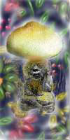

# Erowid Psilocybin Mushroom Vault : Tea Preparation

> ## Excerpt
> Simple Mushroom Tea
Zam's Mushroom Elixir Recipe
Zam's Mushroom Elixir Ritual
Wholistic Psilo-Tea Recipe

---

**-   [Simple Mushroom Tea](https://www.erowid.org/plants/mushrooms/mushrooms_prep2.shtml#Tea2)  
    
-   [Zam's Mushroom Elixir Recipe](https://www.erowid.org/plants/mushrooms/mushrooms_prep2.shtml#Tea1)  
    
-   [Zam's Mushroom Elixir Ritual](https://www.erowid.org/plants/mushrooms/mushrooms_prep2.shtml#Tea3)  
    
-   [Wholistic Psilo-Tea Recipe](https://www.erowid.org/experiences/exp.php?ID=4730)  
    **

___

  
  

1.  Chop or crush mushrooms.  
    
2.  Use 1 cup of water per person and/or 1 cup of water per 5 grams.  
    
3.  Heat water to boiling, pour hot water over mushrooms.  
    
4.  Wait 5-10 minutes, strain water into drinking cup.  
    
5.  Pour a second amount of water over strained mushrooms.  
    
6.  Drink first infusion.  
    
7.  Strain second infusion into drinking cup and drink.  
    

___

  

I would say that mushroom tea is by far the least 'gross' way to go with mushrooms. (though to each their own for sure). I've played with various tea-admixtures and have recently been using:

1.  Yogi Tea brand Licorice Tea  
    Much MUCH better than it sounds if you havent tried it. Extremely interesting / magical flavor. Highly recommended. Other brands of 'licorice spice' are ok.  
    
2.  Small amount of Fresh Ginger - (as a stomach helper).  
    
3.  A little squeeze of a fresh orange  
    Not too much. Adds a little acidity and a nice round flavor.  
    
4.  Sometimes Damiana  
    A very mildly stimulating herb that I find interesting by itself. Set your own admixture herbs according to your tastes and preferences.  
    

I boil the water, pour it over the tea and let it sit until not mouth-burny, and then strain. You don't have to swallow the mushroom parts if they upset your stomach, a majority of the active ingredients of the mushrooms will be extracted into the water. The resulting tea has a very -magical- or -weird- flavor but is not at all like chewing mushrooms into paste in your mouth.

I personally find the idea of 'hiding' the mushrooms inside other edibles to be less than appealing because I often don't want much (or anything) in my stomach at the time.

___

  

A ritual that I've been developing goes something like this:

1.  Start a pot of at least 3 cups of water boiling per person.
2.  chop mushrooms while waiting for water to heat up
3.  place mushrooms in small tea pot or ceramic bowl with spout
4.  pick your favorite herbs, you might consider stomach helpers like ginger, mint, etc or some mildly stimulating herb if you find mushrooms 'sleepy' (damiana, a tiny bit of green tea, etc). I would recommend against trying a new tea or herb for the first time as part of your mushroom Elixir, so work with the herbs beforehand- everyone has very different tastes. I have personally found that Yogi brand Licorice tea (with black pepper) combines very well with Teonanctl - think about taste combinations- mushrooms taste 'earthy' to me with a mysterious bite.
5.  pour ~1 cup hot/almost boiling water over them and go about your pre-mushroom rituals, change clothing, clear a space, get your blanket, find your jacket, prepare an altar, or whatever would make the experience more focused or magical, make you comfortable, try to have everything you are planning on needing prepared before you drink, etc.
6.  Music / Sound: I choose a mellow, meditative music for the drinking period to help me focus and relax.
7.  After 10+ mins, pour the 1 cup Mushroom Elixir into your ritual drinking vessel, straining with a tea strainer (available everywhere) or get a little teapot that has a built in strainer.
8.  Pour another cup of water over the wet mushrooms
9.  Hold the Mushroom Elixir and reflect on where you are, why you are choosing the Mushroom today. Drink slowly and relax into the taste. Imagine that you enjoy it :)
10.  wait at least 5-10 mins before straining off the second cup, then pour another 1/2 - 1 cup of water over mushrooms for a third extraction.
11.  drink 2nd extraction and save the third for later.
12.  relax and lie back and await the peak. I find that if I remain still during the peak, I experience very little stomach unpleasantness.

-   I don't notice any [loss of potency](https://www.erowid.org/plants/mushrooms/mushrooms_info7.shtml) from swallowed dry to the Elixir.
-   I do experience far less stomach distress with tea.

I find that it is quite pleasant to drink the mushroom tea slowly, the effects come on quickly in the tea form and by the time I've finished my first cup, I can feel the Mushroom approaching. By the time I've finished the second cup, there are distinct alerts. I save the third extraction for an hour or more after the first two and find that when I go back to drinking it while bemushroomed to be an interesting and positive experience and the effects also are increased by the third cup at T+60-120. I wouldn't recommend drinking the 3rd cup much after 2 hours as I've found trying to extend the mushroom experience after that to be somewhat unrewarding.

**Other Languages**  
Russian: [Rotten.Splane.ru : Mushroom Prepartion](http://rotten.splane.ru/consume.htm)
