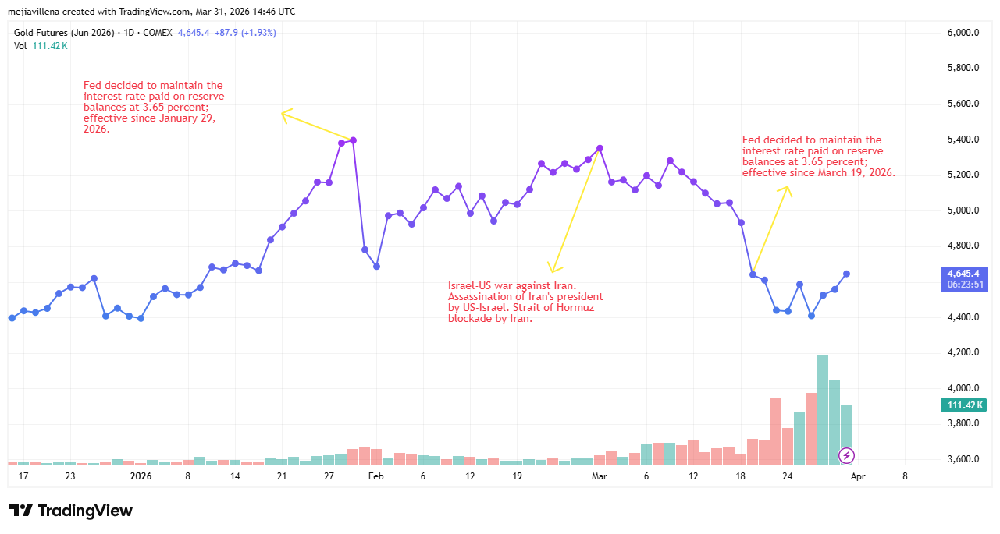

The decision of Fed to maintain the rate of interest unchanged at 3.65% effective since March 19, 2026 counter the expectations of a lower interest rate environment favorable for upward gold prices. Instead, gold prices fall since the initiation of US-Israel war against Iran was triggered by last Fed decision.

The great fail of US-Israel war against Iran is regime change. Indeed, the expectations of a fast US-Israel win by decapitation of Iran's regime drove gold prices downward as the confidence on US hegemony rose. But this tendency is changing as Iran's obstruction of the Hormuz strait reinforce the development of a protracted war in the Middle East, challenging seriously US position in the region. As a consequence, despite the unfavorable environment for a continuing rise of gold prices created by Fed decision to not apply an interest rate cut, gold futures price for June 2026 is upward as inflation diminish the purchasing power of US dollar.